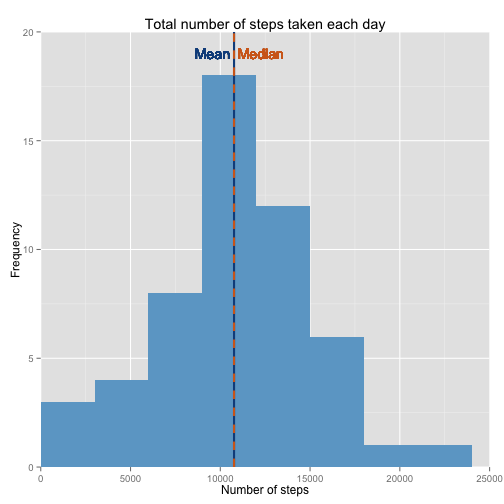
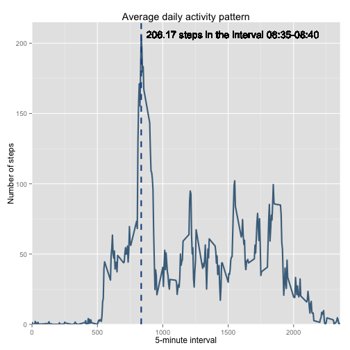
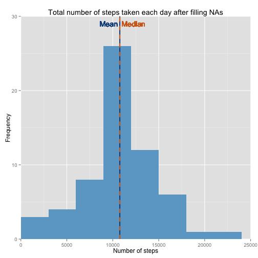
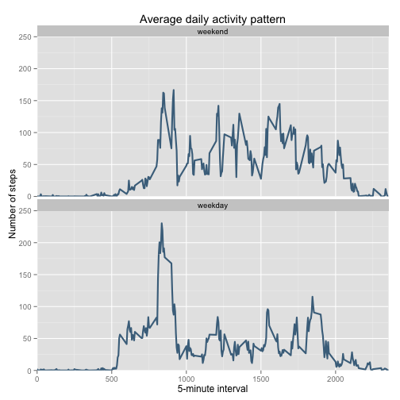

# Reproducible Research: Peer Assessment 1

This report provides the code and figures required in the Peer Assessment 1 in the course Reproducible Research from the Data Science Specialization. This assignment makes use of data from a personal activity monitoring device. This device collects data at 5 minute intervals through out the day. The data consists of two months of data from an anonymous individual collected during the months of October and November, 2012 and include the number of steps taken in 5 minute intervals each day.


## Loading and preprocessing the data

The next code loads the data and converts the date column into the correct format.  


```r
# 1. Read the csv file with the data
data <- read.csv("activity.csv", sep = ",", header = TRUE, colClasses = c("integer", 
    "character", "integer"))
# 2. Convert from character to date
data$date <- as.Date(data$date)
```

## What is mean total number of steps taken per day?

In the following, we sum the number of steps take each day, plot them in a histogram and compute its mean and median.


```r
library(ggplot2)
# Sum steps by day
dataperday <- aggregate(data$steps, by = list(data$date), sum)
# Set column names
colnames(dataperday) <- c("date", "steps")
# Compute the mean
meanperday <- mean(dataperday$steps, na.rm = TRUE)
# Compute the median
medianperday <- median(dataperday$steps, na.rm = TRUE)
# Initial call to ggplot
g <- ggplot(dataperday[!is.na(dataperday$steps), ], aes(steps))
# Create histogram
g + geom_histogram(binwidth = 3000, fill = "skyblue3") + coord_cartesian(ylim = c(0, 
    20), xlim = c(0, 25000)) + labs(title = "Total number of steps taken each day", 
    x = "Number of steps", y = "Frequency") + geom_vline(aes(xintercept = meanperday), 
    size = 1, linetype = 1, col = "dodgerblue4") + geom_text(aes(x = meanperday - 
    1200, y = 19, label = "Mean", fontface = 1), color = "dodgerblue4", size = 5) + 
    geom_vline(aes(xintercept = medianperday), size = 1, linetype = 2, col = "chocolate") + 
    geom_text(aes(x = medianperday + 1500, y = 19, label = "Median", fontface = 1), 
        color = "chocolate", size = 5)
```

 

The mean number of steps taken per day is 10766.19 while its median is 10765.

## What is the average daily activity pattern?

The next code creates a plot with the 5-minute interval in the x-axis and the average number of steps taken, averaged across all days, in the y-axis. Moreover, it obtains the interval that contains the maximum number of steps.


```r
# Obtain the mean for each 5-minute interval
dataperinterval <- aggregate(data$steps, by = list(data$interval), function(x) mean(x, 
    na.rm = TRUE))
# Set column names
colnames(dataperinterval) <- c("interval", "steps")
# Get the 5-minute interval that contain the maximum number of steps
maxsteps <- dataperinterval$interval[which.max(dataperinterval$steps)]
# Initial call to ggplot
g <- ggplot(dataperinterval, aes(interval, steps))
# Create plot
g + geom_line(col = "skyblue4", size = 1) + coord_cartesian(ylim = c(0, 215), 
    xlim = c(0, 2355)) + labs(title = "Average daily activity pattern", x = "5-minute interval", 
    y = "Number of steps") + geom_vline(aes(xintercept = maxsteps), size = 1, 
    linetype = 2, col = "dodgerblue4") + geom_text(aes(x = maxsteps + 700, y = max(dataperinterval$steps), 
    label = paste(round(max(dataperinterval$steps), digits = 2), " steps in the interval ", 
        paste(substr(formatC(maxsteps, width = 4, flag = "0"), 1, 2), substr(formatC(maxsteps, 
            width = 4, flag = "0"), 3, 4), sep = ":"), "-", paste(substr(formatC(maxsteps + 
            5, width = 4, flag = "0"), 1, 2), substr(formatC(maxsteps + 5, width = 4, 
            flag = "0"), 3, 4), sep = ":"), sep = ""), fontface = 1), size = 5)
```

 


The 5-minute interval that contains the maximum averaged number of steps (206.17 steps) is 08:35-08:40 (identifier 835).

## Imputing missing values

The next code replaces the missing values (NA) with the folling strategy: 

1. For each missing value, we find the average number of steps, averaged accross all the days, corresponding to the same 5-minute interval.
2. We round the average value to the nearest unit in order to fill missing data with an integer number of steps.


```r
# 1. Number of NA values
num_na <- sum(is.na(data$steps))
# Copy the data to a new dataset
filleddata <- data
# 2-3. Fill the NA values with the nearest integer of the average number of
# steps in each interval across all the days
for (i in which(is.na(data$steps))) {
    filleddata$steps[i] <- round(dataperinterval$steps[which(dataperinterval$interval == 
        data$interval[i])], digits = 0)
}
# Sum steps by day
filledperday <- aggregate(filleddata$steps, by = list(filleddata$date), sum)
# Set column names
colnames(filledperday) <- c("date", "steps")
# Compute the mean
meanfilledperday <- mean(filledperday$steps, na.rm = TRUE)
# Compute the median
medianfilledperday <- median(filledperday$steps, na.rm = TRUE)
# Initial call to ggplot
g <- ggplot(filledperday, aes(steps))
# 4. Create histogram
g + geom_histogram(binwidth = 3000, fill = "skyblue3") + coord_cartesian(ylim = c(0, 
    30), xlim = c(0, 25000)) + labs(title = "Total number of steps taken each day after filling NAs", 
    x = "Number of steps", y = "Frequency") + geom_vline(aes(xintercept = meanfilledperday), 
    size = 1, linetype = 1, col = "dodgerblue4") + geom_text(aes(x = meanfilledperday - 
    1200, y = 29, label = "Mean", fontface = 1), color = "dodgerblue4", size = 5) + 
    geom_vline(aes(xintercept = medianfilledperday), size = 1, linetype = 2, 
        col = "chocolate") + geom_text(aes(x = medianfilledperday + 1500, y = 29, 
    label = "Median", fontface = 1), color = "chocolate", size = 5)
```

 

The total number of missing values in the original data set is 2304. The new mean number of steps taken per day is 10765.64 while its median is 10762.00. We slightly modify the mean with respect to the first part of the assigment (less than 0.55 steps of difference), however, we reduce the median by three steps. Since we have replaced the missing values with the mean corresponding to that interval, we have incremented the proportion of values that fall into the central bin.

## Are there differences in activity patterns between weekdays and weekends?

Finally, we create a new column in the filled data set with a factor variable (*weekend*) that indicates whether that day corresponds to a weekend day or not. Moreover, the next code creates a plot with the 5-minute interval in the x-axis and the average number of steps taken, averaged across all weekday days or weekend days, in the y-axis.


```r
# Add a column to the filled data set with a factor variable that indicates
# whether that day corresponds to the weekend or not
filleddata <- cbind(filleddata, factor(weekdays(filleddata$date) %in% c("Saturday", 
    "Sunday"), levels = c(TRUE, FALSE), labels = c("weekend", "weekday")))
# Set column names
colnames(filleddata) <- c(colnames(filleddata[1:3]), "weekend")
# Obtain the mean for each 5-minute interval for weekday days and for
# weekend days
dataperintervalweekend <- aggregate(filleddata$steps, by = list(filleddata$interval, 
    filleddata$weekend), function(x) mean(x, na.rm = TRUE))
# Set column names
colnames(dataperintervalweekend) <- c("interval", "weekend", "steps")
# Get the 5-minute interval that contain the maximum number of steps
maxstepsweekend <- dataperintervalweekend$interval[which.max(dataperintervalweekend$steps[dataperintervalweekend$weekend == 
    "weekend"])]
maxstepsweekday <- dataperintervalweekend$interval[which.max(dataperintervalweekend$steps[dataperintervalweekend$weekend == 
    "weekday"])]
# Initial call to ggplot
g <- ggplot(dataperintervalweekend, aes(interval, steps, fill = weekend))
# Create the panel plot
g + geom_line(col = "skyblue4", size = 1) + coord_cartesian(ylim = c(0, 250), 
    xlim = c(0, 2355)) + labs(title = "Average daily activity pattern", x = "5-minute interval", 
    y = "Number of steps") + facet_wrap(~weekend, nrow = 2, ncol = 1)
```

 

The 5-minute interval that contains the maximum averaged number of steps during weekday days (230.36 steps) is 08:35-08:40 (identifier 835). The 5-minute interval that contains the maximum averaged number of steps during weekend days (166.62 steps) is 09:15-09:20 (identifier 915). 

## Conclusions

In this report, we have analyzed data for a personal activity monitoring device. From the presented results we can conclude that:  
  
1. Missing data can be filled without significantly modifying the results. There are several reasons for which it is desirable to have no missing values in the data. Some strategies can be followed to replace such values with data that do not affect the result. Here, we have used the average values rounded to the nearest unit resulting in a final mean and median that differ 0.55 and 3 steps, respectively, from the original result. 

2. The activity pattern changes between weekday and weekend days. During weekday days, the 5-minute interval that reports the highest number of steps is the interval 08:35-08:40 with a noticeable difference between such time slot and the rest of the day. During the weekend, the 5-minute interval that reports the highest number of steps is the interval 09:15-09:20, however, the activity is distributed across the different time slots of the day. 
